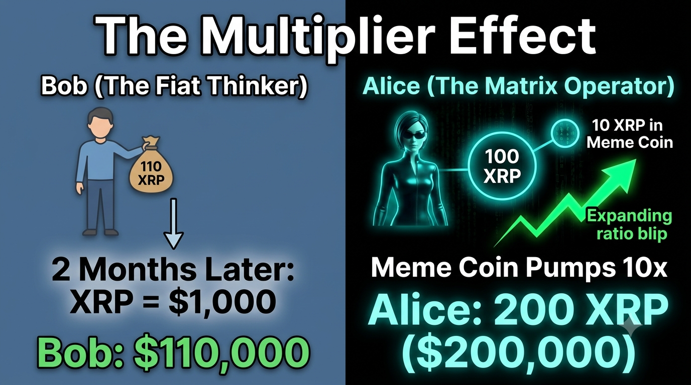
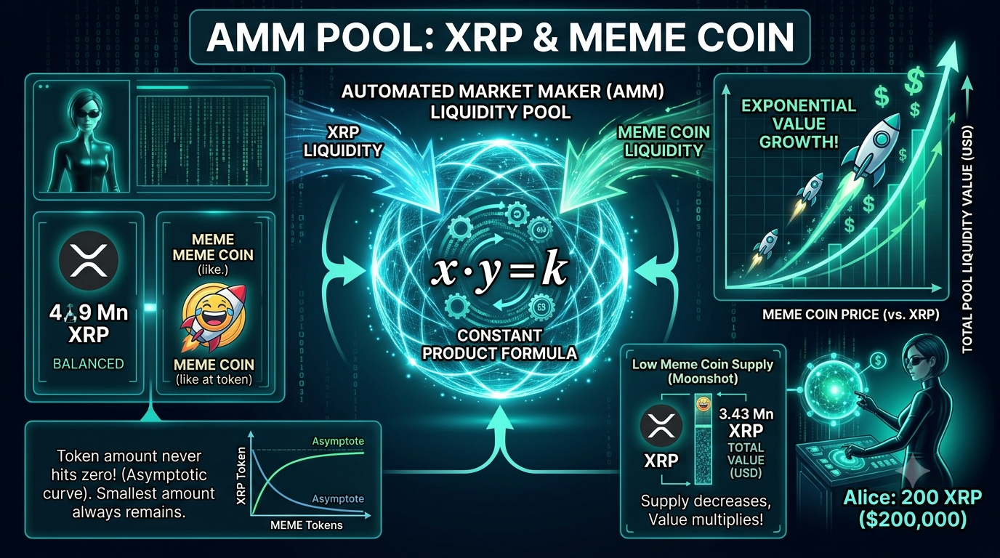
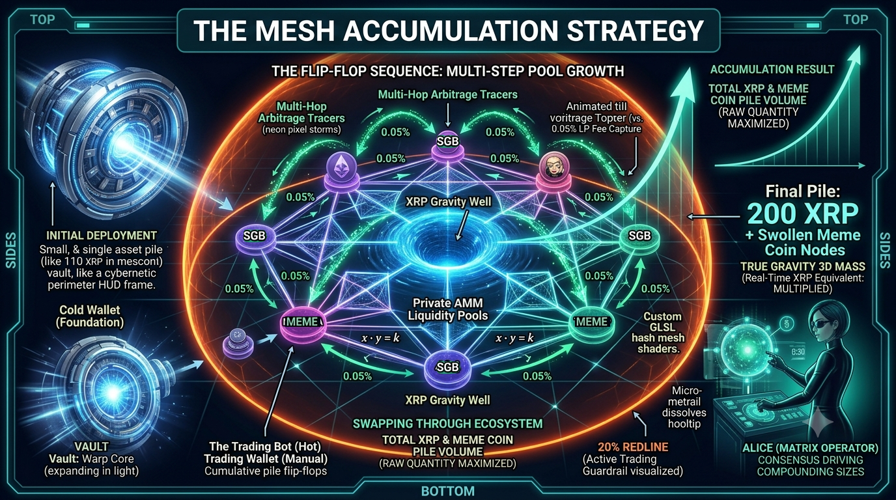
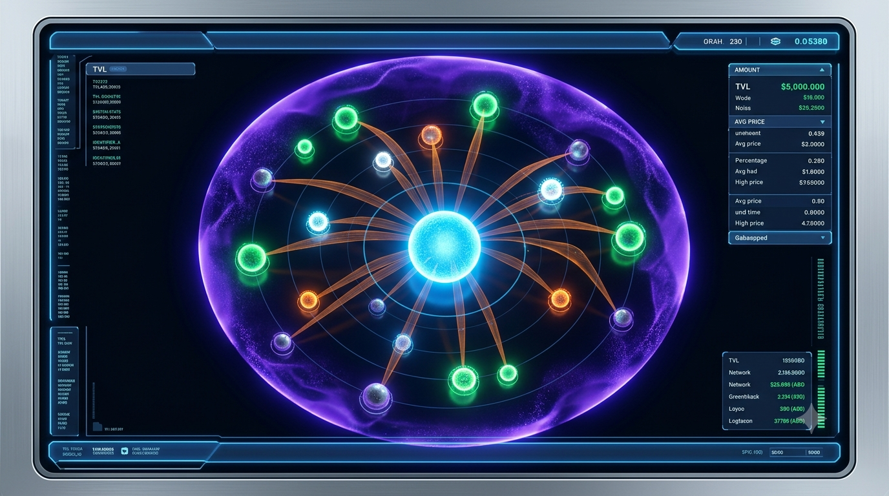

# MyXRPL.com XRPL DeFi Future upgrade

# https://www.youtube.com/watch?v=huMmN5SLq9E&t=7s
****
****
****
****

### 🌌 Interactive "Stellar Cartography" Mechanics

**1. Omni-Directional Camera Controls (The Holographic Table)**

 * **The Mechanic:** OrbitControls with physics-based damping.
 * **The Experience:** This gives you full god-mode control. You can click and drag to orbit the ecosystem, scroll to seamlessly dive into the core, or pan across the void. 
 We will need to restrict the vertical camera angle slightly so it always feels like we're looking down into a tactical table rather than getting lost in empty 3D space.

**2. Proximity-Based Data Revelation (Level of Detail)**
 * **The Mechanic:** We will use camera distance tracking combined with 3D HTML overlays.
 * **The Experience:** When I'm zoomed out, the HUD only displays macro-level health—total ecosystem value and the heartbeat of the bot. As I zoom in on a specific structure (like the rotational rings), the macro data fades out and micro-data fades in, specific asset accumulations, and real-time AMM pool data.

**3. The "Living Organism" Pulse (Algorithmic Shaders)**
 * **The Mechanic:** Rather than static models, the geometry must be driven by custom GLSL shaders (simulate as we're not tied to backend metrics).
 * **The Experience:** The ecosystem will literally breathe. If market volatility spikes or one of the nodes is nearing our threshold, we will be able to see the action happeing live.

This transforms the page from a static reporting tool into a fully interactive living tactical map.Since XRP is our baseline bedrock and we measure the "global displacement mass" purely in xrp_equivalent, the visual size of our ecosystem should be driven by the actual, mathematical weight of the assets, not a hardcoded ratio.

#### 1. Objective & Core Paradigm
MyXRPL.com tracks **asset-to-asset relative exchange ratios** directly rather than absolute fiat or standalone XRP spot prices. All operations are strictly asset-to-asset, leveraging the XRPL AMM pools, using XRP solely as a background normalization anchor to maintain precise structural proportions across the visual coordinate grid.
#### 2. Data Integration & State Mapping
It's an interactive visualization layer looks at cached and live data. The outputs are mapped directly to four distinct visual states:
 * **Outside watch zone:** Each asset pair is a different color. The exchange rate is not high enough to enter our HOT zone (when it enters inside the sliding threshold window, it becomes actively watched and changes to expanding). It returns to its color if it falls back outside the HOT zone.
 * **Expanding (Vibrant Green Blip):** Exchange rate is actively widening in favor of a swap advantage; accumulating unrealized asset volume potential.
 * **Apex (Flashing White / Cyan):** Exchange rate expansion has flattened at its local maximum over the rolling 60 ledgers. Maximum swap yield is active.
 * **Compression (Warning Orange Flashing):** Ratio prints its first confirmed down-tick from the peak. The manual reverse swap window is open.
#### 3. Topography & Living Micro-Physics (3D view anchored in the center)
 * **The Gravity Anchor:** The base currency anchor (XRP) is pinned dead-center at coordinates (0,0).
 * **Radial Distance Calculation:** An asset pair's distance from the center (radius) is determined by its current ratio divergence. Positive divergence pulls the blip inward toward the actionable core; negative divergence drifts it outward.
 * **Living Node Shaders (Vibrations):** Pairs experiencing rapid ratio expansion execute a high-frequency micro-vibration/shake effect to attract immediate tactical focus.
#### 4. Threshold sliding scale
The sliding scale should be shown visually like a movable force field that controls the HOT zone. Show as a **Tactical Purple force field**.
Nodes within the HOT zone means it meets profit threshold (it's inside the force field).
The force field should be transparent and we clearly see the nodes change from their normal color, to green as they enter the HOT zone.
Please move all other tables etc, into compact tables that when clicked on, they pop up front and center until closed.

## Running on IPFS
### 1. Static Export Mode (output: 'export')
To host your dashboard on IPFS, you will configure your Next.js project for static exporting.
 * Next.js compiles your pages into pure static HTML/JS files (out folder) which you then pin to IPFS (via Pinata, web3.storage, or your own local node).
 * When friends load my-xrpl.com via an IPFS gateway or ENS domain (my-xrpl.eth / IPFS hash), the browser downloads the entire React/Three.js frontend instantly.
### 2. Eliminating Server-Side API Routes
Because IPFS has no backend server to run Java or Node.js API endpoints (/api/...), it fetches data  **directly from the client's browser**:
 * **Direct XRPL Public Nodes:** Instead of your frontend talking to a local backend middleware, the client-side JavaScript in the browser connects directly via WebSocket or JSON-RPC to public, load-balanced XRPL nodes (like s1.ripple.com, s2.ripple.com, or xrplcluster.com).
 * **Client-Side Math:** All the relative exchange ratio calculations, node positioning, and 3D coordinate mapping happen right inside the browser.
### 3. Handling Storage via Client-Side Caching (LocalStorage / IndexedDB)
 * When a user inputs their r-address, the app queries the public ledger history directly from that address forward.
 * It saves their last scanned ledger index and preferences locally inside their browser's localStorage or IndexedDB.
 * The next time they open your IPFS-hosted site and enter their address, the app reads that local cache, asks the public XRPL node for only the ledgers *since* that index, and updates seamlessly—completely bypassing the need for a centralized database server.
By shifting the computation and state persistence entirely to the client's browser, your IPFS-hosted myxrpl.com becomes a decentralized, lightning-fast "dumb glass" portal that anyone can pull up anywhere in the world without you having to run heavy infrastructure for them.

# The Future of MyXRPL.com

## MYXRPL_IPFS_BLUEPRINT.md

## 1. Executive Summary & Directive
Objective is to build the next-generation, decentralized IPFS version of **MyXRPL.com**.
 * **Legacy Reference Code:** You have full access to a copy of myxrpl_website legacy code sitting inside the designated local Docker container. **Do not reinvent the wheel for data parsing.** Inspect the containerized codebase to extract the exact transaction history algorithms, chronological swap-pair grouping, running total metrics, and PnL mathematical logic.
 * **Bug Fix Directive:** Resolve the known date/ledger indexing bug present in the legacy cache resumption routine so returning users load incremental ledgers flawlessly.
 * **The New Architecture:** Port these core mechanics into a high-performance Next.js 14 static build (output: 'export') featuring a 3D WebGL "Stellar Cartography" tactical HUD.
## 2. Core Functional Mechanics (Extracted from Legacy Container)
The legacy site provides the proven foundation for asset-to-asset tracking:
 1. **Transaction History Ingestion:** Given a user's r-address, query the XRPL history to load all past swaps.
 2. **Chronological Swap-Pair Grouping:** Group all transactions by Swap Pairs starting from the oldest trade forward while keeping running totals.
 3. **Realized & Unrealized PnL Reporting:** Calculate profit/loss across asset pairs. Mark Token Positions as "Green" once cumulative swaps render the remaining tokens pure profit.
 4. **Reverse Swap Calculations:** Compare cached position entries against live market pricing (polled every minute) to report current reverse-swap profitability.
## 3. Storage & Ledger Synchronization (IPFS Client-Side Engine)
Since this app operates as a serverless static export hosted on IPFS, all network and storage operations execute directly inside the user's browser:
 * **Direct Public RPC/WebSocket:** Connect directly to public XRPL nodes (e.g., s1.ripple.com, xrplcluster.com).
 * **Local Persistence (LocalStorage / IndexedDB):** Store swap histories, chart data, and the last_scanned_ledger_index locally.
 * **Incremental Ledger Fetching:** Upon reopening the app, read the local cache, query public nodes *only* for ledgers closed after last_scanned_ledger_index, merge the datasets, and update local state. *(Note: Ensure date/ledger bounds checks prevent duplicate entry bugs during cache hydration)*.
## 4. Front-End Topography: 3D "Stellar Cartography" HUD
The user interface replaces static tables with an interactive 3D tactical map:
### A. 3D Coordinates & Micro-Physics
 * **The Bedrock Anchor:** XRP is locked at the central origin (0,0,0). Global displacement mass and visual node sizes scale mathematically using true xrp_equivalent mass.
 * **Radial Distance Engine:** Distance from center is driven by ratio divergence. Positive divergence pulls nodes inward toward the core; negative divergence drifts them outward.
 * **Camera Mechanics:** OrbitControls with physics-based damping restricted in vertical orbit to retain a "tactical table" perspective.
 * **Proximity Level-of-Detail (LOD):** Zooming out surfaces macro metrics; zooming in surfaces micro-wallet balances and depth metrics.
### B. Node Visual States
 1. **Outside Watch Zone (Base Color):** Exchange rate is outside the HOT zone threshold.
 2. **Expanding (Vibrant Green):** Ratio widening in favor of a swap advantage; node executes high-frequency GLSL micro-vibrations.
 3. **Apex (Flashing White / Cyan):** Ratio expansion flattened over a rolling 60-ledger window; maximum yield reached.
 4. **Compression (Warning Orange):** First confirmed down-tick from peak; reverse swap window open.
### C. Visual Threshold Force Field
 * A transparent **Tactical Purple force field** represents the movable profit threshold.
 * Nodes crossing inside this boundary automatically shift from their standard color to **Expanding Green**.
 * Secondary data grids and historical tables are collapsed into glassmorphic pop-up overlays that render center-screen only when clicked.
## 5. Technical Stack Requirements
 * **Framework:** Next.js 14 (output: 'export')
 * **Rendering:** Three.js / React Three Fiber / GLSL Shaders
 * **Network:** @xrplf/xrpl-client or direct WebSocket connections to public XRPL RPCs
 * **Client Storage:** idb (IndexedDB wrapper) + LocalStorage
